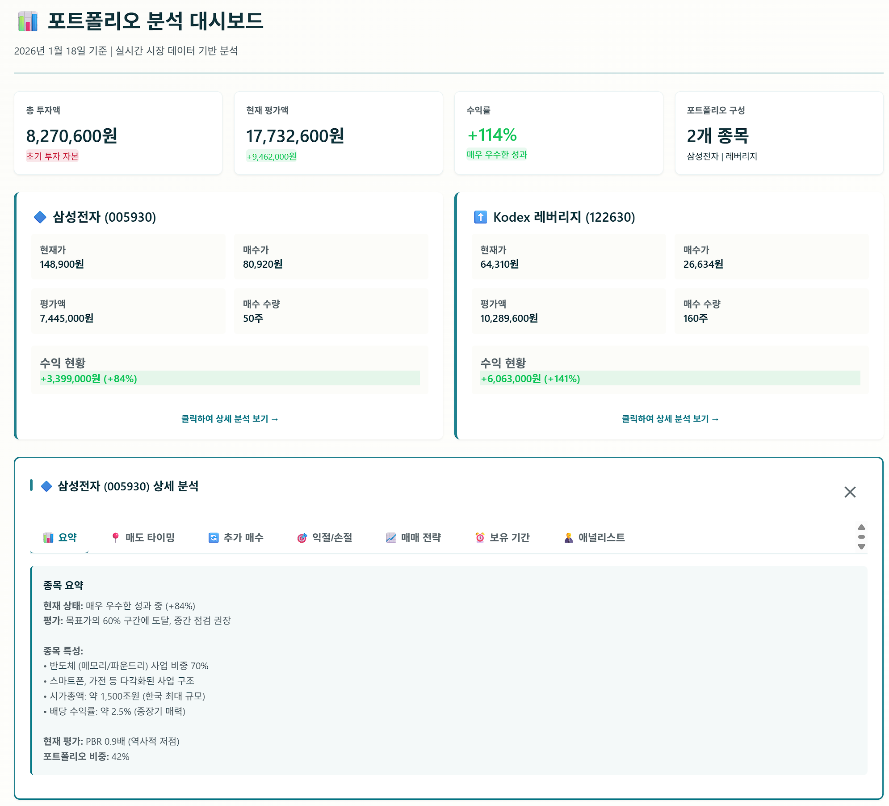
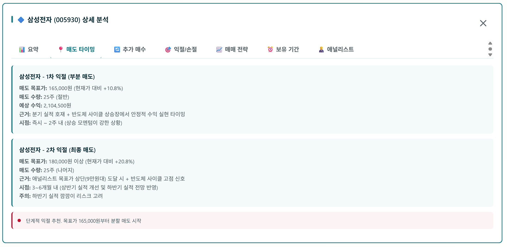
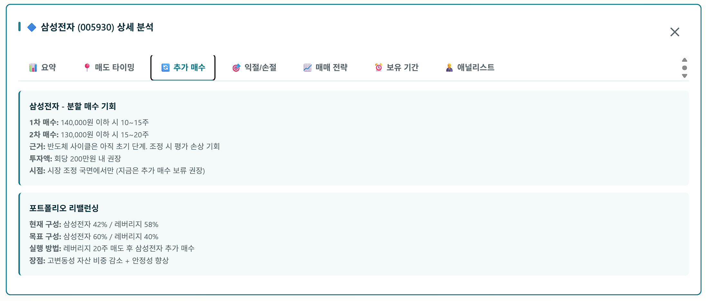
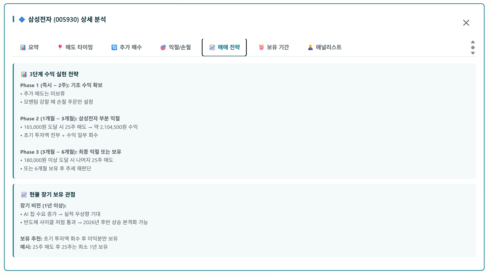
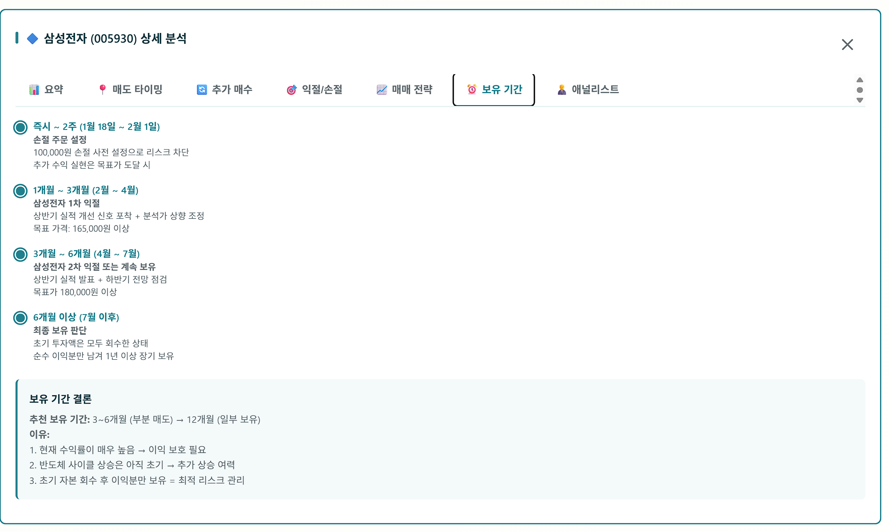
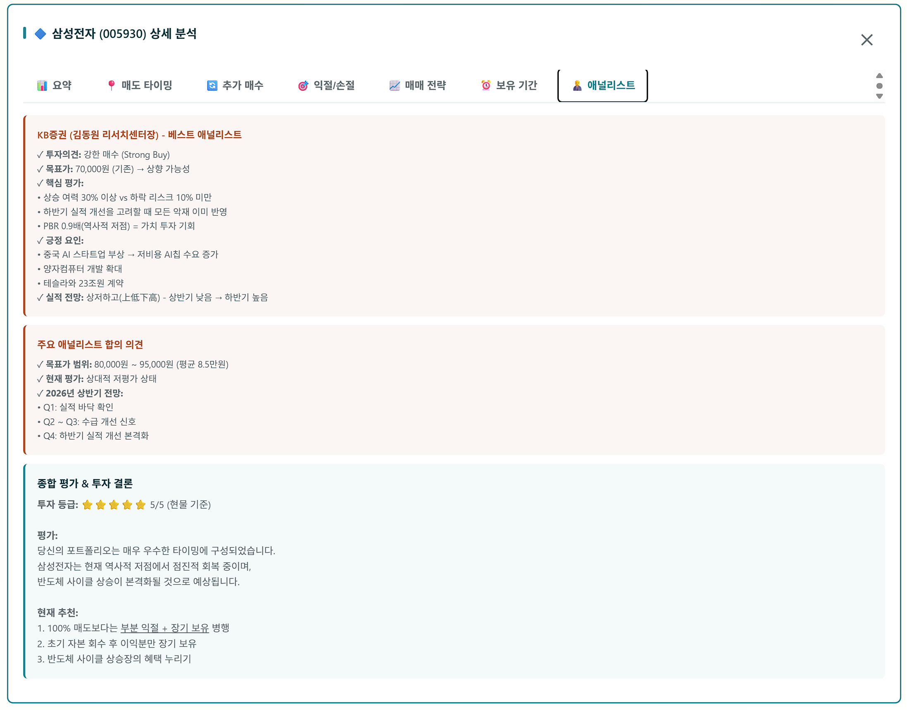

# 📄 포트폴리오 분석 대시보드 – 기능 명세서 (PRD)

---

## 1. 제품 개요

### 1.1 제품명

- 개인 투자자용 포트폴리오 분석 및 리포팅 플랫폼

### 1.2 제품 목적

- 사용자가 보유한 주식 포트폴리오를 기반으로
  - 현재 성과 분석
  - 리스크 평가
  - 매도/추가매수/보유 전략 추천
  - 애널리스트 의견 요약
  - 종합 투자 결론 제시
- 개인 투자자가 **전문 리서치 리포트 수준의 분석 결과**를 손쉽게 확인하고 의사결정을 지원받을 수 있도록 함.

---

## 2. 대상 사용자 (Target Users)

- 개인 투자자 (초급~중급)
- 직접 투자 전략을 수립하되, 리서치 기반 의사결정 보조가 필요한 사용자
- 주식, ETF, 레버리지 상품을 포함한 포트폴리오 운용 사용자

---

## 3. 핵심 가치 제안 (Value Proposition)

- 복잡한 금융 분석을 자동화하여 **직관적인 대시보드와 리포트 형태**로 제공
- 실시간 시장 데이터 + 애널리스트 의견 + AI 분석을 통합한 **통합 투자 판단 플랫폼**
- 단순 조회 앱이 아닌 **전략 제안 중심 리서치 도구**

---

## 4. 핵심 성공 지표 (Success Metrics)

- DAU/MAU 비율
- 리포트 조회 수 및 재방문률
- 추천 전략 실행 비율
- 사용자 만족도 설문 점수
- 목표가/손절가 알림 반응률

---

## 5. 시스템 범위 (In Scope / Out of Scope)

### In Scope

- 포트폴리오 분석 및 리포팅
- 투자 전략 추천
- 실시간 알림
- 리포트 자동 생성

### Out of Scope

- 실제 주문/거래 실행 기능
- 증권사 계좌 직접 연동 (1차 버전 제외 가능)

---

## 6. 기능 요구사항 (Functional Requirements)

---

### 6.1 사용자 데이터 입력 모듈

#### 목적

- 사용자의 보유 종목 데이터를 수집하여 분석의 기초 데이터로 활용

#### 기능 요구사항

- 사용자는 다음 정보를 입력/수정할 수 있어야 함:
  - 종목 코드 / 종목명
  - 매수가
  - 보유 수량
  - 매수일
  - 추가 매수 이력
  - 투자 성향 (단기/중기/장기, 공격/중립/보수)
  - 목표 수익률 / 허용 손실률

#### 비기능 요구사항

- 입력 데이터는 실시간 저장 및 수정 가능해야 함
- 데이터는 사용자 계정 단위로 분리 관리되어야 함

---

### 6.2 시장 데이터 연동 모듈

#### 목적

- 실시간 및 과거 시장 데이터를 분석 엔진에 제공

#### 기능 요구사항

- 다음 데이터 자동 수집:
  - 현재가, 전일 대비, 거래량
  - 과거 가격 시계열 (일/주/월)
  - 업종 및 시장 지수
  - 재무제표 (분기/연간)
  - 밸류에이션 지표 (PER, PBR, ROE 등)
  - 애널리스트 리포트, 목표주가 컨센서스
  - 뉴스, 공시, 이벤트 일정

#### 비기능 요구사항

- 데이터는 정기적으로 자동 업데이트되어야 함
- 데이터 정합성 및 오류 감지 로직이 포함되어야 함

---

### 6.3 포트폴리오 요약 대시보드 모듈

#### 목적

- 사용자의 포트폴리오 전체 성과를 한 눈에 파악할 수 있도록 제공

#### 기능 요구사항

- 다음 요약 지표를 자동 계산 및 표시:
  - 총 투자액
  - 현재 평가액
  - 총 수익금 / 수익률 (%)
  - 포트폴리오 구성 종목 수
  - 성과 등급 (매우 우수 / 우수 / 보통 / 주의)

---

### 6.4 종목 카드 표시 모듈

#### 목적

- 각 보유 종목의 핵심 정보를 카드 형태로 제공

#### 기능 요구사항

- 각 종목 카드에는 다음 정보가 표시되어야 함:
  - 종목명 / 종목코드
  - 현재가
  - 매수가
  - 평가금액
  - 보유 수량
  - 수익금 / 수익률
  - 성과 상태 배지 (강세 / 중립 / 약세)
- 사용자는 카드 클릭 시 종목 상세 분석 화면으로 이동 가능해야 함

---

### 6.5 종목 상세 분석 모듈 (탭 구조)

#### 목적

- 종목별 심층 분석 결과를 구조화하여 제공

---

#### 6.5.1 요약 탭 (Summary Tab)

- 기능 요구사항
  - 현재 성과 상태 자동 평가 문장 생성
  - 목표가 대비 현재 위치 평가
  - 종목 특성 요약 제공 (사업 구조, 산업 포지션, 배당 성향 등)
  - 밸류에이션 상태 요약 (PER, PBR 등)
  - 포트폴리오 내 비중 표시

---

#### 6.5.2 매도 타이밍 탭 (Exit Timing Tab)

- 기능 요구사항
  - 1차 익절 전략 자동 생성:
    - 목표가
    - 매도 수량
    - 예상 수익
    - 근거 (기술적/펀더멘털)
    - 권장 시점
  - 2차 익절 전략 자동 생성:
    - 최종 목표가
    - 잔여 물량 매도 전략
    - 리스크 요인
    - 예상 보유 기간
  - 단계적 익절 추천 문구 자동 표시

---

#### 6.5.3 추가 매수 탭 (Accumulation Tab)

- 기능 요구사항
  - 추가 매수 가능 구간 자동 산출
  - 권장 추가 매수 비중(%) 제시
  - 매수 시점 조건 제시 (실적, 기술적 신호, 시장 상황)

---

#### 6.5.4 익절/손절 탭 (Risk Control Tab)

- 기능 요구사항
  - 손절선 자동 계산:
    - 가격 기준 손절선
    - 포트폴리오 손실 한도 기준 손절선
  - 주요 리스크 요인 요약
  - 방어 전략 제시 (부분 매도, 비중 축소, 헤지 등)

---

#### 6.5.5 매매 전략 탭 (Trading Strategy Tab)

- 기능 요구사항
  - 현재 시장 국면 자동 판단
  - 권장 전략 유형 제시 (단기/중기/장기)
  - 포트폴리오 내 종목 역할 정의

---

#### 6.5.6 보유 기간 탭 (Holding Period Tab)

- 기능 요구사항
  - 권장 보유 기간 제시 (단기/중기/장기)
  - 보유 근거 설명 (산업 사이클, 실적 사이클, 거시 환경)

---

#### 6.5.7 애널리스트 탭 (Analyst Tab)

- 기능 요구사항
  - 주요 증권사 리포트 요약 제공
  - 투자 의견, 목표주가 범위 및 평균 표시
  - 상·하방 여력 분석 제공
  - 연간/분기별 전망 타임라인 생성

---

### 6.6 종합 평가 및 투자 결론 모듈 (Final Verdict Module)

#### 목적

- 모든 분석 결과를 종합하여 최종 투자 판단을 제공

#### 기능 요구사항

- 투자 등급(1~5점) 자동 산출
- 종합 평가 문장 자동 생성
- 현재 추천 전략 요약 제공:
  - 부분 익절 + 장기 보유
  - 수익 일부 확보 + 리스크 관리
  - 산업 사이클 수혜 유지

---

### 6.7 포트폴리오 리밸런싱 모듈

#### 목적

- 포트폴리오 구조의 비효율 및 리스크를 자동 감지하고 개선안 제시

#### 기능 요구사항

- 종목 비중 과다/과소 자동 감지
- 업종 편중 여부 분석
- 레버리지/고위험 자산 비중 경고
- 추천 리밸런싱 시나리오 생성

---

### 6.8 리포트 자동 생성 및 저장 모듈 (Auto Reporting Module)

#### 목적

- 분석 결과를 리포트 형태로 저장 및 공유 가능하도록 제공

#### 기능 요구사항

- 리포트 출력 형식:
  - 웹 대시보드
  - PDF 다운로드
  - 주간/월간 리포트 자동 발송
- 리포트 구성 자동 생성:
  1. 포트폴리오 요약
  2. 종목별 상세 분석
  3. 매도/추가매수/보유 전략
  4. 애널리스트 의견 요약
  5. 종합 투자 결론
  6. 향후 모니터링 체크리스트

---

### 6.9 실시간 알림 및 모니터링 모듈

#### 목적

- 투자 판단에 중요한 이벤트 발생 시 즉각적인 사용자 인지 지원

#### 기능 요구사항

- 목표가 도달 알림
- 손절선 근접 알림
- 실적 발표/중대 뉴스 알림
- 포트폴리오 리스크 급증 경고

---

## 7. 비기능 요구사항 (Non-Functional Requirements)

- 성능
  
  - 대시보드 로딩 시간 2초 이내
  - 데이터 갱신 주기 설정 가능

- 보안
  
  - 사용자 데이터 암호화 저장
  - 계정 기반 접근 제어

- 확장성
  
  - 종목 수 증가 시 성능 저하 없이 확장 가능
  - 추후 자산군(채권, 코인 등) 확장 가능 구조

- 가용성
  
  - 99.9% 이상의 서비스 가용성 목표

---

## 8. 제약사항 및 리스크

- 외부 금융 데이터 API 품질 및 비용
- 애널리스트 리포트 저작권 및 요약 제공 범위
- 시장 급변 시 추천 전략의 신뢰성 관리

---

## 9. 향후 확장 방향 (Future Roadmap)

- 증권사 계좌 연동

- 자동 매매(트레이딩 봇) 기능 연계

- 머신러닝 기반 수익률 예측 모델

- 자산군 확장 (ETF, 채권, 코인, 해외주식)

- 증권사 계좌 연동

- 자동 매매(트레이딩 봇) 기능 연계

- 머신러닝 기반 수익률 예측 모델

- 자산군 확장 (ETF, 채권, 코인, 해외주식)

## 10.  프로젝트  구성 방법

- 프로젝트 구조(폴더 트리) 작성
- 전체 워크플로우 작성
- 에이전트(sub agent) 설계 계획
- skills 설계 계획
- 향후 배포는 github에 push하면 firebase hosting을 통해서 서비스 제공할 계획
- UI/UX 컴포넌트들은 stroybook을 사용하여 제작
- 데이터는 firestore DB 사용

## [참고] 참고 서비스 대시보드 이미지

